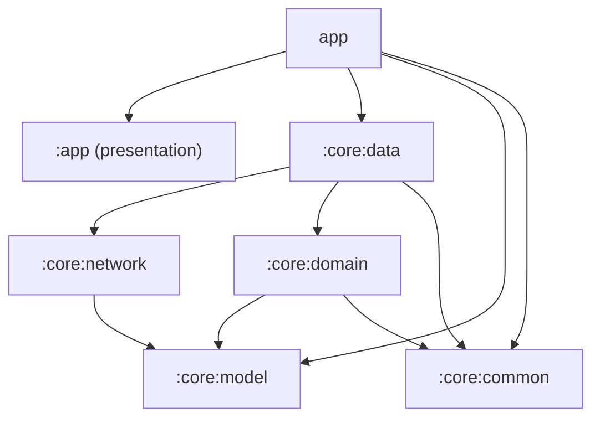

# 🎬 CineTrack

A movie discovery Android app built with **Kotlin, Jetpack Compose, and Clean
Architecture** — powered by [The Movie Database (TMDB)](https://www.themoviedb.org/) API.


---

## 📱 Screenshots

| Trending                         | Search                              | Detail      |
|----------------------------------|-------------------------------------|-------------|
|() | (,) |(
) |


## ✨ Features

- **Trending movies** — daily trending list from TMDB, displayed in a 2-column grid
- **Search** — debounced, cancellation-safe search-as-you-type (Kotlin Flow: `debounce` + `flatMapLatest`)
- **Movie detail** — poster, rating, genres, overview, and cast, fetched via **two API calls in parallel** (`async`/`awaitAll`)
- Offline-safe error handling with a sealed `Result` type across the entire data layer

## 🏗️ Architecture

Clean Architecture across **6 Gradle modules**, with a strict one-directional dependency graph:



| Module | Responsibility |
|---|---|
| `:core:model` | Pure Kotlin domain models (`Movie`, `MovieDetail`) — zero Android dependencies |
| `:core:network` | Retrofit `TmdbApi` + DTOs |
| `:core:common` | Shared utilities: `Result<T>` sealed type, `safeApiCall`, `fetchParallel` |
| `:core:domain` | Repository interfaces (dependency inversion boundary) |
| `:core:data` | Repository implementations + DTO-to-domain mappers |
| `:app` | Hilt wiring, ViewModels, Jetpack Compose UI, Activities |

Each `:core:*` module (except `network`, which needs Retrofit) is a **plain Kotlin JVM
module** — no Android dependency, compiles faster, and proves the business logic
doesn't secretly depend on the Android framework.

## 🧰 Tech Stack

| Layer | Tools |
|---|---|
| UI | Jetpack Compose, Material 3 |
| Architecture | MVVM, Clean Architecture, Unidirectional Data Flow |
| DI | Hilt |
| Async | Kotlin Coroutines & Flow |
| Networking | Retrofit, OkHttp, Moshi |
| Images | Coil |
| Testing | JUnit, Compose UI Testing, JaCoCo coverage |
| Performance | LeakCanary, Baseline Profiles |
| CI/CD | GitHub Actions |

## 🧪 Testing

```bash
./gradlew test                    # unit tests (ViewModels, mappers, repositories)
./gradlew connectedAndroidTest     # Compose UI tests (requires emulator/device)
./gradlew jacocoTestReport         # coverage report (app/build/reports/jacoco/...)
```

Business logic (ViewModels, domain, data layer) is unit tested; UI is verified with
Compose UI tests (`createComposeRule`, `onNodeWithText`, `performTextInput`) covering
all Loading/Success/Empty/Error states per screen.

## 🚀 Getting Started

1. Get a free TMDB API key: [themoviedb.org/settings/api](https://www.themoviedb.org/settings/api)
   (use the **API Read Access Token**, not the v3 API key — this project authenticates via a Bearer token interceptor)
2. Add it to `local.properties` at the project root:
   ```properties
   TMDB_API_KEY=your_bearer_token_here
   ```
3. Open in Android Studio, sync Gradle, run on emulator or device (API 24+)

## 📈 Performance & Quality

- **LeakCanary** integrated in debug builds — verified clean across Trending → Search → Detail navigation
- **Baseline Profile** generated via Macrobenchmark, precompiling startup-critical paths (including app-specific classes like `CineTrackApp`)
- **CI pipeline** runs unit tests and a debug build on every push/PR to `main`

## 🗺️ What this project demonstrates

This app was built as a structured, hands-on path through senior Android skills —
each feature intentionally reinforces or introduces a specific concept:

- Kotlin idioms (scope functions, sealed classes, coroutines, extension functions)
- MVVM + Clean Architecture + multi-module Gradle setup
- Modern async patterns: `debounce`/`flatMapLatest` for search, `async`/`awaitAll` for parallel detail fetches
- Full XML → Jetpack Compose migration, including stateful/stateless composable separation for testability
- Unit + UI testing, code coverage analysis
- Production tooling: memory leak detection, startup optimization, CI/CD

---

*Built as part of a self-directed senior Android engineering roadmap.*
